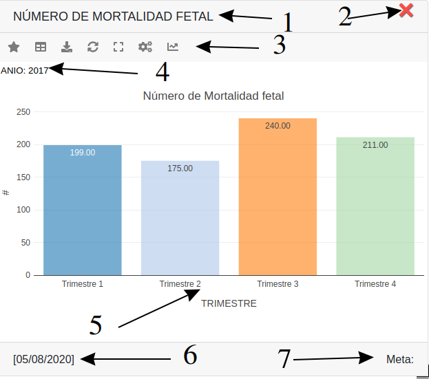
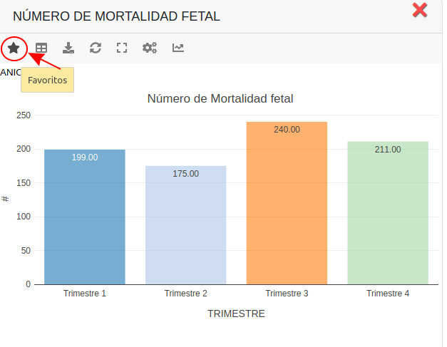
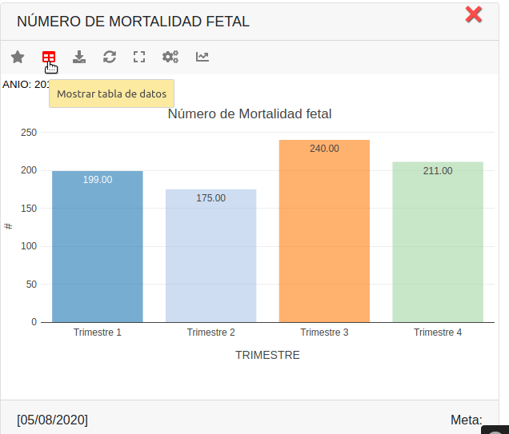
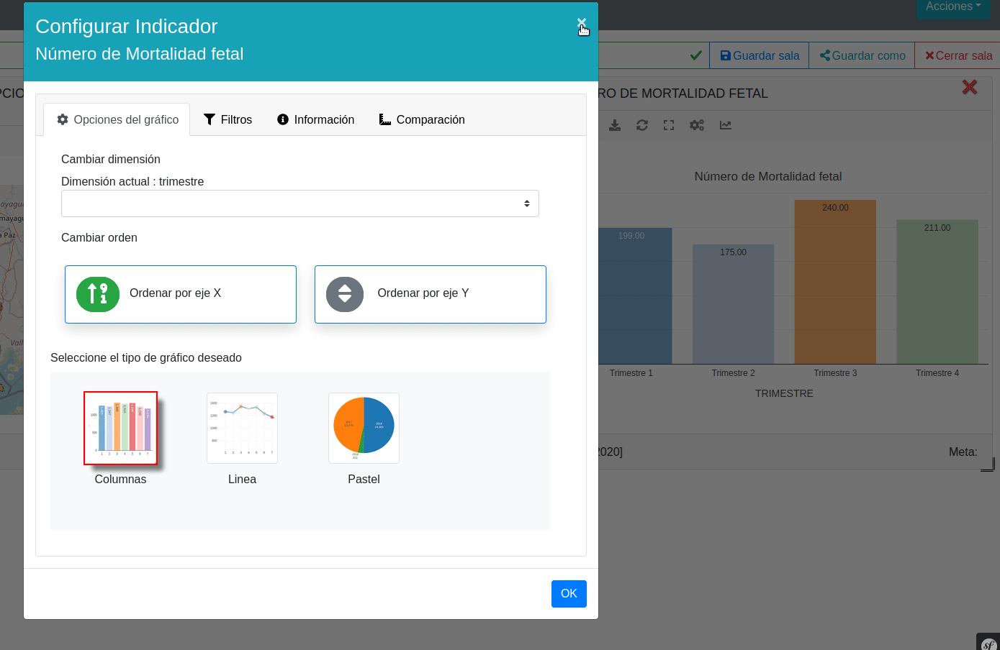
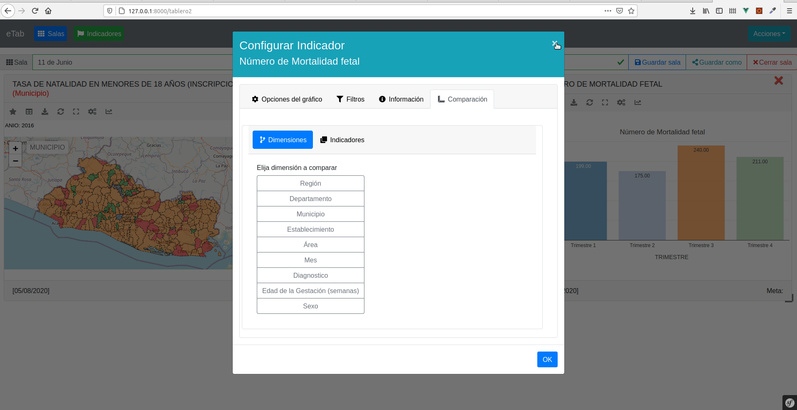

# Indicador
 

La sección de cada gráfico de un indicador, consta de las siguientes secciones:

 
>**Gráfico**

> - 1.- Nombre del indicador
> - 2.- Cerrar el gráfico.
> - 3.- Opciones y acciones
> - 4.- Filtro aplicado
> - 5.- Gráfico según los datos del indicador y las opciones elegidas
> - 6.- Última actualización de los datos.
> - 7.- Meta del indicador (si la tiene configurada)

 
## Favoritos
 

<strong>Favoritos:</strong> se agrega o se quita de la lista de favoritos al hacer clic

 
## Mostrar tabla de datos
 

Permite mostrar/ocultar la tabla de datos en lugar del gráfico

 
## Descargar gráfico
 

Se utiliza para descargar el gráfico, como un archivo de imagen.

 
## Refrescar
 

Al dar clic en el botón refrescar, se reinicia el gráfico quitando los filtros y colocando por defecto la primera dimensión.

 
## Pantalla completa
 

Permite ver el fráfico actual en pantalla completa

 
## Configurar
 

Muestra las opciones para configurar el gráfico, al dar clic en este botón se abrirá una ventana con las siguientes grupo de opciones:

> - 1.- Opciones del gráfico
> - 2.- Filtrar
> - 3.- Información
> - 4.- Comparación

 
## Opciones del gráfico
 

Contiene los parámetros de configuración del gráfico, tales como:

> - 1.- Dimensión a utilizar para graficar
> - 2.- El orden de los datos mostrados en el gráfico. Si el tipo gráfico no se puede ordenar, como pastel y mapa, no se mostrarán los opciones para cambiar el orden de los datos
> - 3.- Tipo de grafico a utilizar, en la ficha técnica se configura de manera general qué gráficos se pueden utilizar en el indicador, además en el significado de campo (dimensión del gráfico) se configura de manera específica para cada dimensión

 
## Filtros
 

Se utiliza para elegir mostrar solo algunos de los elementos del gráfico, por ejemplo si tenemos un gráfico que muestra datos de 10 años, podríamos elegir mostrar solo una parte de esos años. Para hacer esto debemos dar clic en los elementos que deseamos mostrar, alternativamente también podemos elegir los elementos arrastrando el puntero del ratón sobre ellos.

 
## Información
 

En esta pestaña se puede consultar la ficha técnica del indicador, la tabla de datos que se utiliza para el gráfico, los rangos de alerta (si están configurados para el indicador) y la sentencia SQL con la cual se han optenido los datos. Además se puede encontrar botones para exportar a hoja de cálculo, pdf o cvs.

 

 
## Información
 

En esta pestaña podemos comparar un indicador graficando dos de sus dimensiones o mostrando dos indicadores a la vez.
Para graficar dos dimensiones para compararlas, en la sección de comparación->Dimensiones debemos dar clic en la dimensión que se quiera agregar.

Para mostrar dos indicadores en el mismo gráfico, en la sección de comparación->Indicadores escribimos parte del nombre del indicador que se desea agregar y se presiona ENTER, se cargará una lista con los indicadores que coinciden con el texto de búsqueda, para elegir uno de ellos se debe dar clic en el botón a la derecha del nombre.

 

 
## Tendencia
 

<strong>Icono tendencia:</strong> Si el gráfico se puede expresar a travez del tiempo es decir que los datos tengan mes y año entonces se puede graficar en forma de tendencia con esta opción

 

<strong>Si esta activado la tendencia:</strong> El boton cambia para poder reestablecer

 