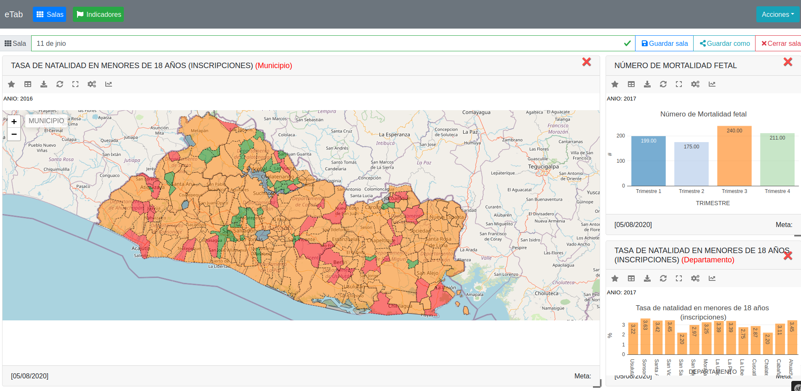
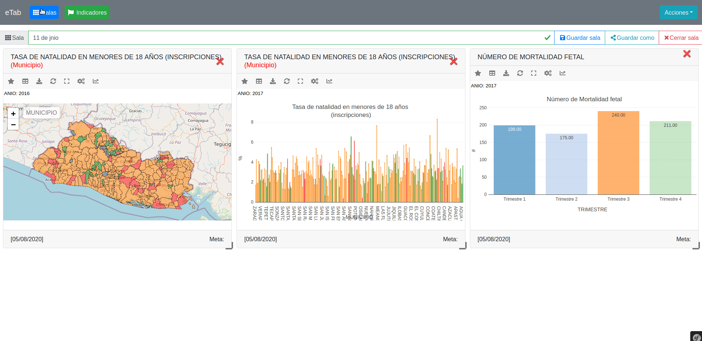
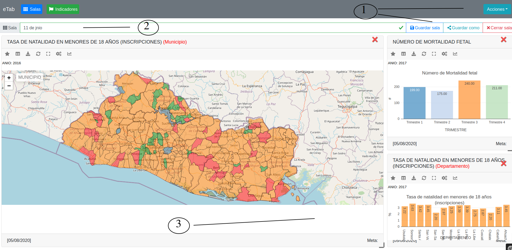
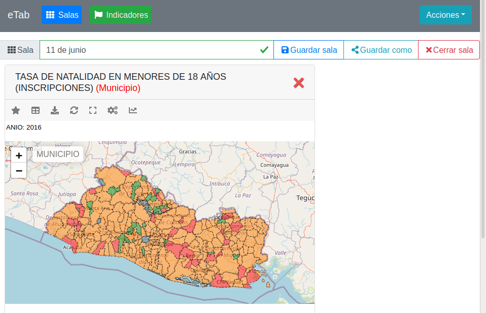
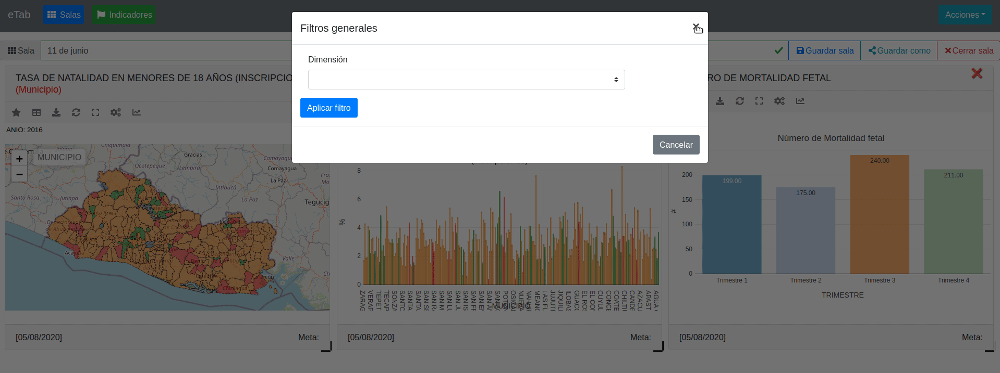

# Salas
 

Las salas son un grupo de indicadores, que se guardan con sus respectivas opciones, filtros y tamaños, se pueden comprartir con otros usuarios para tener un foro de discusión o simplemente para hacer notar un hallazgo.

 
## Filtros
 

Para acceder a una sala es necesario primero hacer clic al boton salas y abrir los filtros para encontrar la sala a la que tenemos acceso, ya sea que nosotros las creemos o bien que alguien más nos compartió

 

 
## Eliminar sala
 

Una vez que se crean las salas solo pueden ser borradas por la persona que las creó, para ello accedemos a la segunda pestaña de la venta de filtros del botón salas.

 
>**Eliminar**

> - 1.- acceder a la pestaña numero 2
> - 2.- Hacer click al boton rojo eliminar
> - 3.- Se nos pide una confirmación, si es positiva se borra

 
## Sala cargada
 

Al hacer clic en una sala, se nos mostrara el area de gráfico todos los indicadores que pertenecen a la sala. Solo se puede tener abierto una sala, es decir que si tenemos una sala abierta y hacemos clic en otra sala la sala anterior se cerrara y solo quedaran los indicadores de la sala abierta.

 
>**Elementos**

> - 1.- Acciones para el usuario con la sala
> - 2.- Nombre de la sala
> - 3.- Indicadores con sus respectivos datos, cargados y graficados segun la configuración guardada

 

Todos los indicadores cargados en el area de gráficos son independientes unos de otros, aún si el indicador es el mismo se puede guardar cada uno con diferentes filtros, y diferente tipo de gráfica, tambien se puede guardar el tamaño de cada gráfico y cambiar la posición del indicador con solo arrastrar y soltar. de esta forma podemos asignarle el aspecto que se dese a nuestra sala, y al compartirlo o abrirlo lo veamos igual cada vez.

## Guardar Sala
 

Para guardar la sala, simplemente de clic al boton "Guardar sala" despues de hacer clic aparecera un mensaje de confirmación, si quiere guardar la sala con otro nombre utilice el botón "Guardar como". Si solo quiere cambiar el nombre de la sala, escríbalo en la casilla del nombre y de clic en "Guardar sala" y el botón "Cerrar sala" es para cerrar la sala y todos sus indicadores.

## Filtros generales

Esta opción se utiliza para aplicar filtros a todos los indicadores cargados en la sala

1. Dar clic en el botón **Filtros generales**
2. Elegir la dimensión por la cual vamos a filtrar
3. Ingresar el valor a asignar al filtro
4. Dar clic en aplicar filtro

Si alguno de los indicadores no tiene la dimensión seleccionada, el filtro no será aplicado a dicho indicador

