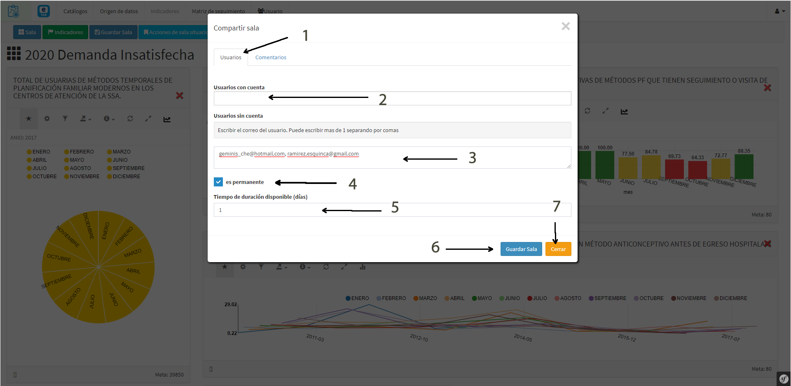

# Social
 

Dentro de las acciones que se pueden hacer en una sala está la parte social, que corresponde a como en equipo podemos dar seguimiento a un indicador para lograr las metas programadas. En esta seccion veremos como compartir las salas y como asignarle comentarios y acciones, asi como las opciones de exportacion.

 
## Acciones de sala situacional
 

Las acciones nos ilustran los retos a los que nos enfrentamos en un indicador para alcanzar su objetivo, aca podemos describir las actividades y retos asi como asignar la o las personas responsables de tales acciones con el único fin de alcanzar la meta programada. Para ver o iniciar una acción hacer clic en el boton "Acciones" luego elegir "Acciones de sala situacional"

 

 
>**Acciones**

> - 1.- Después de abrir la ventana nos aparecen 2 pestañas, la primera es para agregar acciones
> - 2.- Describir la acción a implementar
> - 3.- Describir las complicaciones u observaciones
> - 4.- Asignar a un responsable de la acción
> - 5.- Guardar los cambios
> - 6.- Cerrar la ventana

 

 
>**Historial**

> - 1.- Segunda pestaña historial de acciones
> - 2.- Cada fila corresponde a una acción

 
## Compartir sala
 

Podemos compartir la sala y generar un acceso temporal en dias o bien permanentemente, mediante la siguinete opción "Compartir sala" del botón "Acciones"

 
>**Compartir**

> - 1.- Programar los usuarios
> - 2.- Seleccionar los usuarios que tienen cuenta
> - 3.- Agregar los correos de las personas que no tienen cuenta, sepuede escribir mas de uno seprandolo por comas (,)
> - 4.- Marcar si el acceso va a ser permanente, si se marca esta casilla se hace caso omiso a los dias
> - 5.- Número de dias de vigencia para el acceso
> - 6.- Guardar los cambios
> - 7.- Cerrar la ventana

 

Al correo electrónico de las personas que se les compartió llegará el un correo con un contenido similar al mostrado en la imagen y tendrá los enlaces para entrar a la sala.

 
## Exportar sala
 

Podemos exportar las salas por su tabla de datos, su diccionario o bien la imagen de las gráficas

