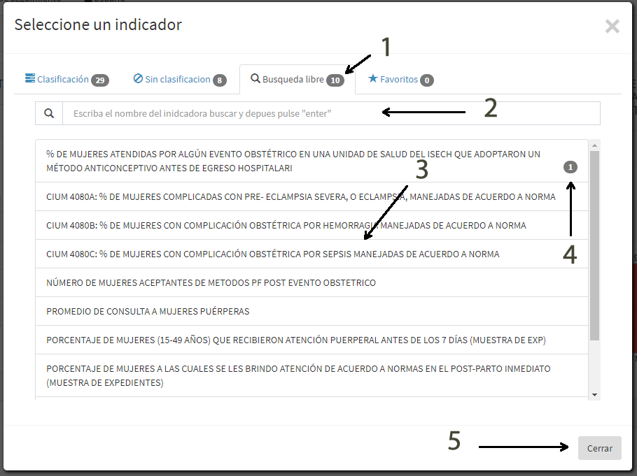

# Tablero

El SIIG/eTAB es una herramienta que propone proveer información y datos presentando estos de una manera accesible y objetiva, utilizando visualizaciones gráficas de diferentes tipos (gráficas, mapas, tablas interactivas) que buscará distribuir y proveer información de diferentes programas de forma unificada. Por lo tanto, el eTAB será alimentado por los datos obtenidos a partir de la información administrativa producida por el sistema estatal y nacional de información de salud.

## Objetivo

El siguiente manual es para explicar el uso de la herramienta web eTAB.
El eTAB en línea es construido para mostrar graficamente la información concentrada de diferentes fuentes de datos

 
## Inicio

Al entrar al tabblero hay 2 botones que inician todo el proceso para visualizar los gráficos. Y se mostrará un mensaje de confirmación de que se han cargado los datos de salas e indicadores.

 

>>**Acciones**

> - 1.- Salas: Lista todas las salas a las que se tiene acceso
> - 2.- Indicadores: Lista todos los indicadores disponibles

 
## Indicadores
 

Para cargar un indicador al área de trabajo, es necesario seleccionarlo de la lista para ello hacemos clic en el botón "Indicadores" y aparecerá la ventana que nos permitirá buscar indicadores: Con clasificación, no clasificados, búsqueda libre y favoritos.

## Indicadores (Clasificación)
 

En esta sección se encuentran todos los indicadores que tienen una claificación según uso y una clasificacion técnica, esto se configura en la ficha técnica

 
>**Para cargar un indicador que tiene clasificación realizamos los siguientes pasos:**

> - 1.- Elegimos la clasificación según uso
> - 2.- Se cargan las clasificaciones técnicas que pertenecen a la clasficación de uso. Se elige la clasificación técnica deseada
> - 3.- Se cargan los indicadores que pertencen a la clasificación técnica elegida
> - 4.- Para elegir/cargar algún indicador damos clic sobre su nombre.
> - 5.- Se puede utilizar la casilla de "Buscar" para escribir parte del nombre del indicador y el listado se filtrará según el texto ingresado aquí

 
## Indicadores (Sin clasificación)
 

En esta sección se encuentra todos los indicadores que no tienen una claificación

 
>**Sin clasificación**

> - 1.- Número de indicadores encontrados
> - 2.- Búsqueda en la lista cargada
> - 3.- Lista de indicadores
> - 4.- Número de veces que el inidcador ha sido agregado al área de gráficos
> - 5.- Cerrar ventana

 
## Indicadores (Búsqueda libre)
 

En esta sección se encuentra un campo de busqueda para escribir el nombre de un indicador y luego presionar la tecla ENTER, nos retorna todos los indicadores que coincidan con el texto a buscar

 
>**Búsqueda**

> - 1.- Número de indicadores encontrados
> - 2.- Búsqueda en la base de datos (Se activa al dar enter)
> - 3.- Lista de indicadores
> - 4.- Número de veces que el indicador ha sido agregado al área de gráficos
> - 5.- Cerrar ventana

 
## Indicadores (Favoritos)
 

En esta sección se encuentra todos los inidcadores que el usuario ha marcado como favoritos

 
>**Favoritos**

> - 1.- Número de indicadores encontrados
> - 2.- Búsqueda en la lista cargada
> - 3.- Lista de indicadores
> - 4.- Número de veces que el inidcador ha sido agregado al área de gráficos
> - 5.- Cerrar ventana
