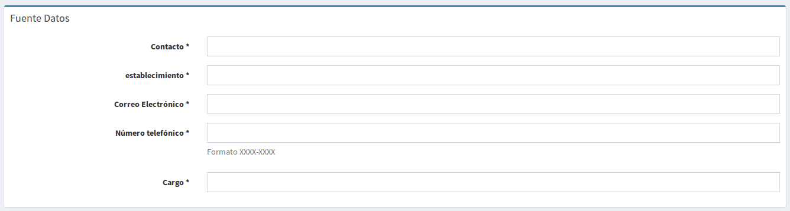
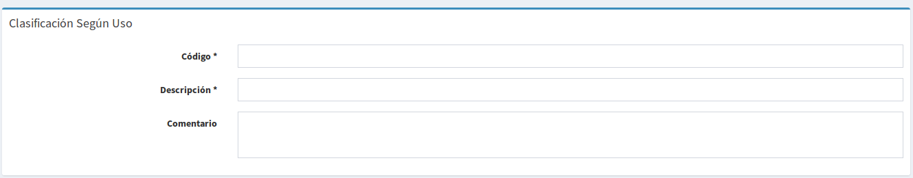
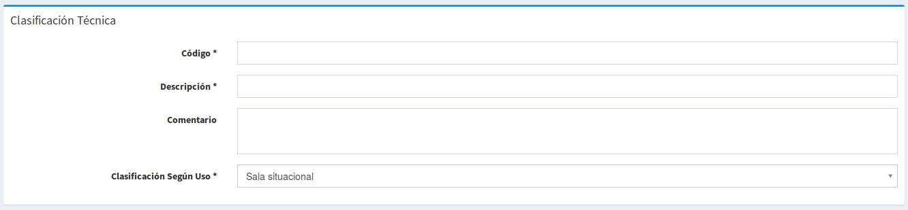
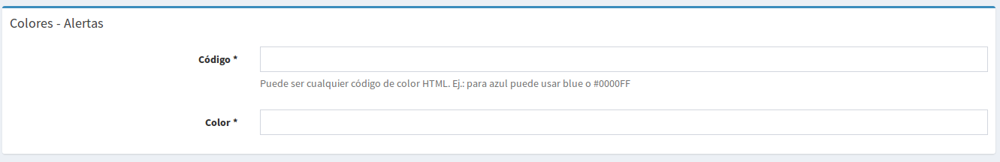

#Catálogos
Las siguientes opciones están ubicadas en el menú principal **Catálogos**

## Fuente de datos

- **Contacto:** Nombre de la persona que proporciona datos.
- **Establecimiento:** Organismo al que pertenece el contacto.
- **Correo electrónico:** Correo electrónico oficial del contacto.
- **Número telefónico:** Número telefónico del contacto.
- **Cargo:** Cargo que ocupa el contacto dentro del organismo al que pertenece.

## Responsable de datos

- **Contacto:** Nombre de la persona que es reponsable de los datos y la calidad de estos (Podría ser el mismo que en Fuente de datos).
- **Establecimiento:** Organismo al que pertenece el contacto.
- **Correo electrónico:** Correo electrónico oficial del contacto.
- **Número telefónico:** Número telefónico del contacto.
- **Cargo:** Cargo que ocupa el contacto dentro del organismo al que pertenece.

## Responsable indicador

- **Contacto:** Nombre de la persona que es reponsable de hacer el seguimiento y control del indicador.
- **Establecimiento:** Organismo al que pertenece el contacto.
- **Correo electrónico:** Correo electrónico oficial del contacto.
- **Número telefónico:** Número telefónico del contacto.
- **Cargo:** Cargo que ocupa el contacto dentro del organismo al que pertenece.

## Clasificación según uso

- **Código:** Clave con el que será identificado de manera técnica.
- **Descripción:** Nombre de la clasificación según uso. Indica el uso para el que puede estar destinado un indicador.
- **Comentario:** Nota o comentario que se quiera agregar, opcional.

## Clasificación técnica

- **Código:** Clave con el que será identificado.
- **Descripción:** Nombre de la Clasificación técnica. Esta es una subdivisión de la clasificación según uso.
- **Comentario:** Nota o comentario que se quiera agregar, opcional.
- **Clasificación Según Uso:** Es la clasificación según uso a la que pertenece.

## Significado de campos
Se utiliza para identificar de manera estándar los datos provenientes de los orígenes. Por ejemplo en una base de datos el campo puede llamarse **fecha_nacimiento**, en otra puede llamarse **fecha_nac** y en ambos casos se refiere a lo mismo.

- **Código:** Identificador del significado.
- **Descripción:** Nombre del significado
- **Utilizado para costeo:** Marque esta casilla, si el significado será exclusivo para formularios de costeo.
- **Describirá campos de catálogo:** Aquellos campos de tablas catálogos como, llave primaria, llave foránea, entre otros.
- **Catálogo asociado:** Asociar un catálogo a un significado permitirá cargar otros datos por ejemplo que el campo sea una llave foránea y los demás datos se encuentren en una tabla catálogo. Ej.: código de municipio, y en la tabla catálogo se encontrará el nombre del municipio.
- **Tipos de gráficos permitidos:** Se debe elegir los tipos de gráficos que se pueden usar sobre este campo

## Colores - Alertas

- **Código:** Para crear colores y usarlos posteriormente en la definición de rangos de alertas, aquí ingresará un código del color en formato usado en HTML.
- **Color:** Nombre que se mostrará para el color

