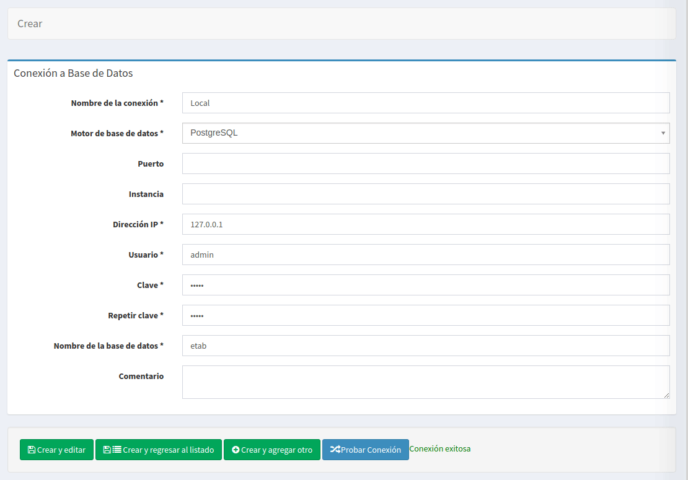
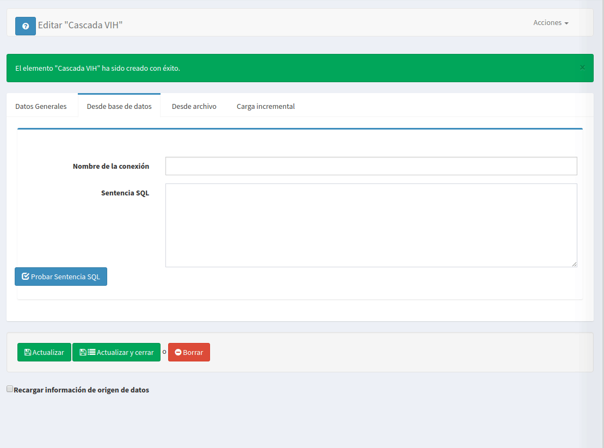
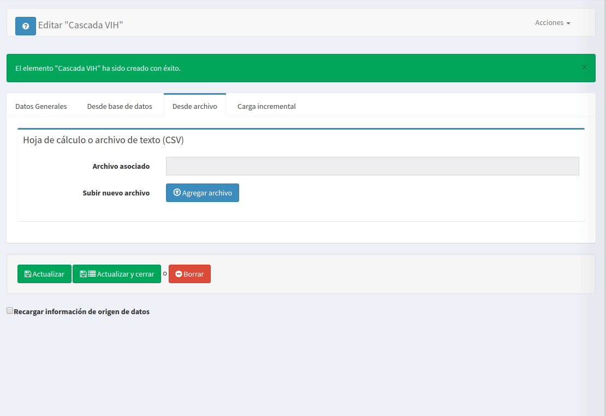
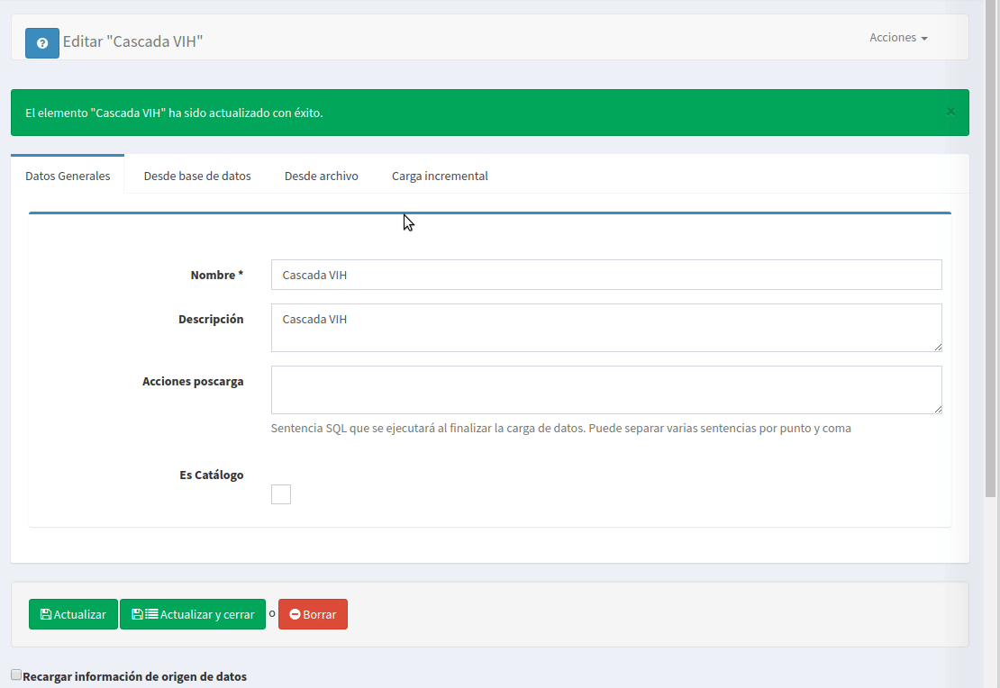
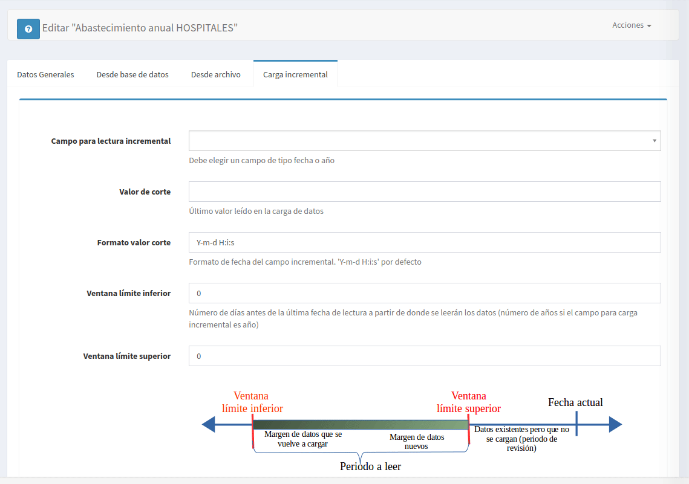

# ETL
El bloque ETL (Extract Transform Load) es la sección dónde se configuran los orígenes de datos y se obtiene la información de ellos.

## Conexión a bases de datos
Cuando los datos provienen de una base de datos ya existente, se debe configurar antes la conexión a ésta. 
Los motores soportados son: PostgreSQL, MySQL, SQL Server y Oracle.
Se inicia en el menú **Origen de Datos --> Conexión a base de datos** Debemos ingresar los datos necesarios para configurar la conexión, 
una vez ingresados se puede probar la conexión con el botón **Probar Conexión** el cual nos devolverá un mensaje con el resultado de la prueba.

## Origen de datos
Para la creación de un origen de datos tenemos las secciones: 
- **Datos generales** que contendrá la descripción general del origen. 
- **Desde base de datos** donde especificará si los datos se obtendrán desde una conexión a una base de datos o desde un archivo.
- **Desde archivo** cuando los datos sean obtenidos de un archivo de hoja de cálculo o con formato csv.
- **Carga incremental** Para orígens de datos que tengan un campo fecha o año, se puede indicar que la carga se inicie a partir del último registro de la 
carga anterior, tomando algunos de estos campos (fecha o año ) como punto de control.

En la sección de datos generales debemos especificar:
- El nombre del origen de datos
- Opcionalmente una descripción
- Acciones poscarga, que consisten en una o más sentencias SQL separadas por punto y coma(;) que se ejecutarán después de realizar la carga de datos. 
Esto es útil por ejemplo, para separar los datos en diferentes tablas o para ejecutar transformaciones de datos.
- Si el origen de datos lo utilizaremos para cargar datos de tablas catálogos. De ser así, el origen de datos se guardará en una tabla *nombre_origen_ctl*, 
estas tablas pueden ser usadas posteriormente para enlazar campos que sean llaves foráneas.

Para realizar la carga desde una base de datos se debe seleccionar la ficha **Desde base de datos** . 
Ahí se ingresará el nombre de la conexión y la sentencia SQL para extraer los datos, es recomendable probar la sentencia 
antes de guardarla con el botón **Probar Sentencia SQL** la cual mostrará un mensaje con el resultado de la prueba y un 
listado de datos de muestra en el caso que ejecución de la sentencia haya sido exitosa.

Para cargar datos desde un archivo, debemos especificar la ruta del archivo, el cual puede ser una hoja electrónica
o un archivo de texto con formato de valores separados por comas (CSV).

#### Configuración de un origen de datos
Al especificar las opciones necesarias en el formulario de origen de datos y guardarlo se cargará una nueva sección en la parte inferior del formulario, 
por medio de la cual debemos configurar los datos obtenidos.

Es de suma importancia realizar esta configuración correctamente. Debemos especificar para cada campo su significado. El significado 
del campo determinará qué es lo que almacenará y por medio de éste se permitirá luego relacionar campos de diferentes orígenes de datos, 
un significado de campo solo puede aparecer una vez en cada origen de datos. Un campo con especial importancia 
es el **Campo para cálculos** el cual identificará el campo que se utilizará para realizar los cálculos dentro de la fórmula del indicador.

#### Carga incremental
Por defecto cada vez que se lee un origen de datos se hace una lectura completa, sustituyendo los valores de lecturas anteriores, 
si la cantidad de datos es muy grande puede ser más conveniente hacer cargas incrementales, la cual consiste en leer los datos a 
partir del punto en que fueron leidos en una lectura anterior y así cargar solamente los datos nuevos.

Para configurar la carga incremental tiene que especificar:
- **Campo para lectura incremental**. El campo que se usará como punto de control de la carga incremental, debe ser un campo de tipo fecha o año. 
- **Valor de corte**. Especificando este campo, al realizar una segunda lectura, se determinará el último valor leido y se recuperarán los valores mayores a éste.
Se puede dejar vació ya que se actualizará con el valor del último registro leido en la carga de datos. 
- **Ventana límite inferior**. Representa el número de unidades (días si el campo de control es fecha o años para campo de control años) que se volverán a 
leer a partir del valor de corte. Por ejemplo: si el valor de corte es *13/02/2016* y el límite inferior es *3* se leerá a partir de *10/02/2016*
- **Ventana límite superior**. Este controla el número de unidades que se descontarán de la fecha actual, para realizar la lectura. 
Por ejemplo: si la fecha actual es *15/09/2016* y el límite superior es *5*, no se leerán los datos hasta la fecha actual sino 5 días antes, 
es decir hasta *10/09/2016*

