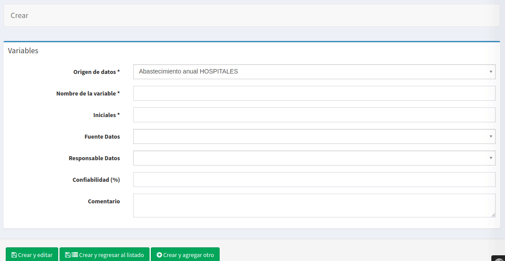
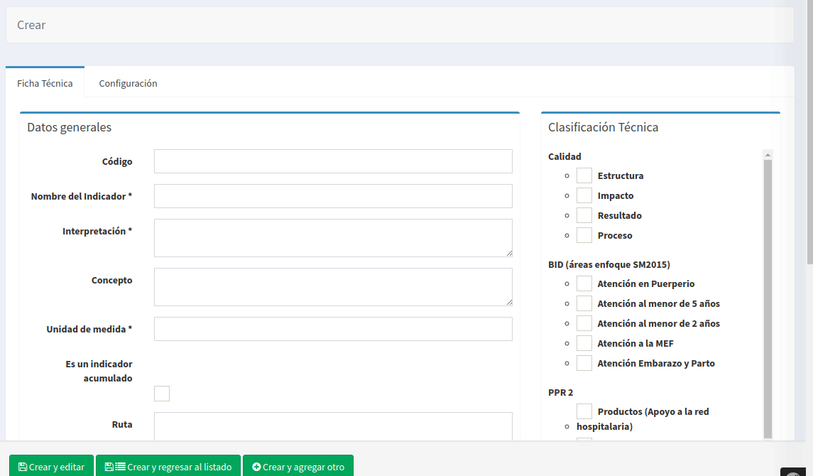
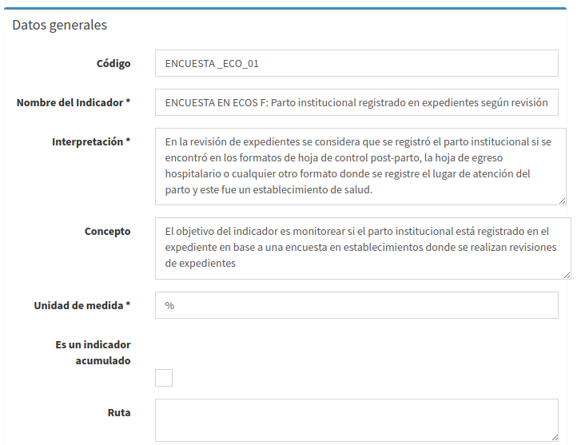
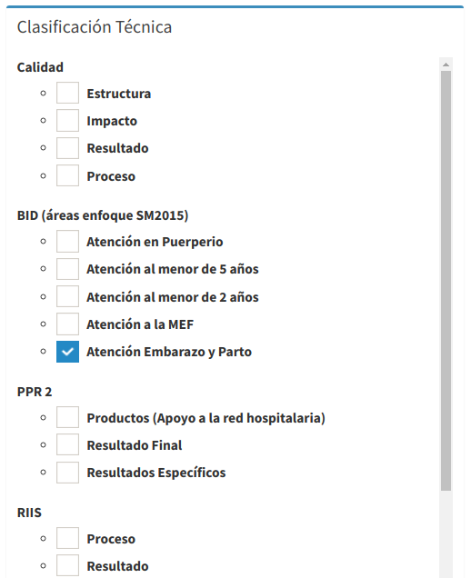

# Ficha técnica: Configuración del indicador #
En esta sección se creará y configurará el indicador, esto se hace mediante una ficha técnica, la cual describe las características del indicador y su fórmula de cálculo.

## Variables
El primero paso a realizar en esta sección es la creación de las variables que intervienen en la fórmula para calcular el indicador. Elegir en el menú principal **Indicadores->Variables**.
La puntos más importantes para la correcta creación de una variables es especificar el origen de datos asociado, el nombre de la variable y sus iniciales.

## Ficha técnica
La ficha técnica es la que contendrá toda la descripción del indicador, el formulario de la ficha técnica es de los más largos, se explicará por partes. Cargar desde el menú principal **Indicadores->Ficha técnica**

### Datos generales
Describe los campos que describen al indicador:
 
- **Código:** Valor que identifique al indicador
- **Nombre:** Nombre corto que describa el indicador
- **Interpretación:** La forma en que se deben interpretar los datos obtenidos o aclaración sobre los datos registrados
- **Concepto:** Concepto u objetivo del indicador
- **Unidad de medida:**: Unidad de medida que regresará el resultado de aplicar la fórmula de cálculo
- **Ruta**: Si los datos son obtenidos de algún sistema de información, se colocan los pasos a seguir para llegar a ellos.

### Definición de la fórmula

Se debe indicar las variables que se utilizarán en la fórmula del indicador y escribir la fórmula, tomando en cuenta:
1. Solo puede utilizar operadores matemáticos: /, *, +, - (, )
2. Para utilizar las variables debe escribir las iniciales de la variable entre llaves { }
3. Se verificará la sintaxis de la fórmula y que utilice las variables seleccionadas.

### Otros datos

- **Tipos de gráficos permitidos:** Indicar los gráficos que se desea que se puedan utilizar para este idnicador en el tablero.
Si se deja este campo vacío se permitirán todos los tipos de gráficos.
- **Cantidad de decimales:** El número de decimales para mostrar los resultados de la fórmula.
- **Meta:** Valor objetivo del indicador, en algunos tipos de gráficos la meta se representa como una línea horizontal.
- **Periocidad:** Frecuencia con que se obtienen datos de la medición.
- **Confiabilidad:** Indicar un porcentaje de confiabilidad de los datos obtenidos.
- **Observación:** Comentarios generales

### Clasificación técnica
Se elige la categoría a la que pertenece el indicador

### Configuración - Alertas
Para la generación de alertas del indicador podemos establecer un valor estándar o una serie de rangos de valores y 
asignar un color y comentario que describa el comportamiento del indicador en ese rango de valores.

### Configuración - Orden de dimensiones del indicador
Una vez guardado la ficha técnica, se realiza el cálculo de cuales son sus indicadores disponibles, 
lo cual se obtiene a partir de los campos comunes de las variables que intervienen en el cálculo del indicador. 
Se puede cambiar el orden por defecto en que se presentarán las dimensiones en el tablero, para eso editamos la ficha técnica 
y vamos al final del formulario, encontraremos las dimensiones del indicador y podemos especificar el orden arrastrando cada una de ellas.

