# Tabla Pivote
La función básica de la tabla pivote es convertir un conjunto de datos en una tabla resumen. Se puede manipular 
la tabla resumen utilizando su interfaz de usuario que permite arrastrar y soltar los campos en la disposición 
deseada y convirtiéndola en una tabla pivote, muy similar a la que se encuentra en las hojas de cálculo.
Además se puede utilizar gráficos para representar los datos en la tabla, generando un gráfico pivote.
Para acceder a la tabla dinámica se hace a través del menú **Indicadores --> Tabla dinámica**.

## Descripción de la interfáz de usuario
Se dispone de dos pestañas principales, una donde se elige el indicador, cuyos datos se desean cargar a la tabla 
pivote, y la sección que nos permitirá ver y manipular esta tabla.

### Cargar un indicador
Para elegir un indicador se selecciona la pestaña **Indicadores**, la cual contiene un listado agrupado según una clasificación.
Se puede cambiar la clasificación por la que nos interese y podemos utilizar la casilla de búsqueda para filtrar el listado.
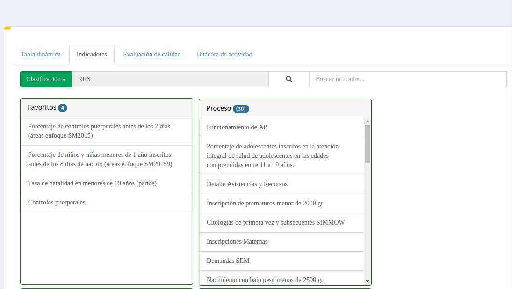

La siguiente figura muestra la interfaz inicial de la tabla pivote

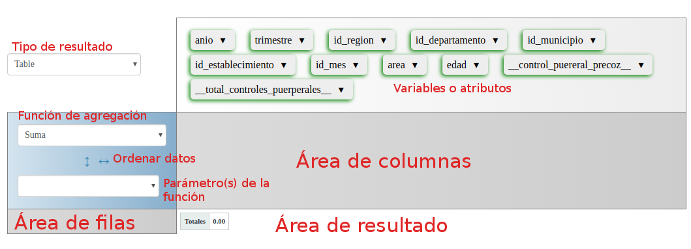

### Disposición de campos
El siguiente punto es arrastrar los atributos deseados y soltarlos en las áreas filas y columnas, según se requiera.

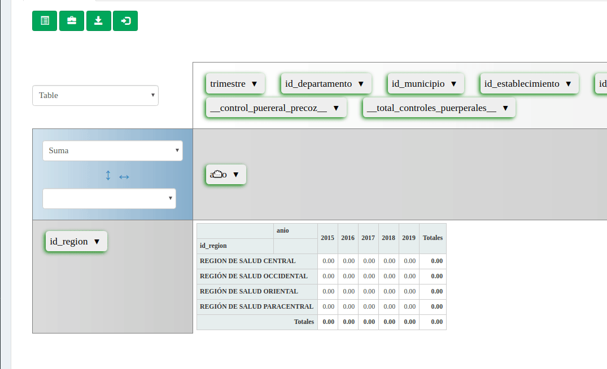

### Función de agregación
De acuerdo al tipo de análisis que se quiera realizar debemos elegir la función de agregación adecuada.
Entre algunas de las funciones de agregación tenemos:

* Contar
* Suma
* Suma entera
* Promedio: Realiza la función de promedio aritmético
* Cociente: Utiliza dos atributos para su cálculo y se devuelve el cociente de ellos.
* Proporción del total: Cada celda se calcula como porcentaje tomando como 100% el total general.
* Proporción de filas: Cada celda se calcula como porcentaje tomando como 100% el total de la fila.
* Proporción de columnas: Cada celda se calcula como porcentaje tomando como 100% el total de la columna. 

Si elegimos una función de agregación diferente a contar debemos especificar sobre qué atributo(s) se calculará la función. 
Los atributos cuyo nombre tiene dos guiones bajos al principio y final, como `__total_controles_puerpuerales__` son las variables de la fórmula de cálculo
definida en la ficha técnica.

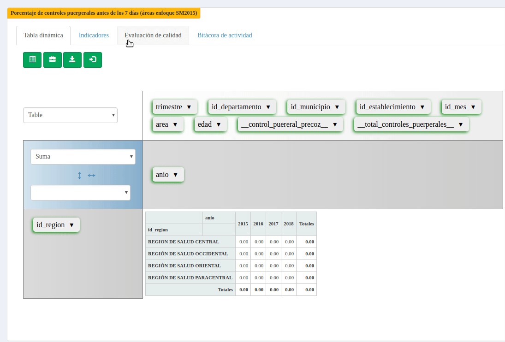

### Tipo de resultado
Establece la visualización que le daremos a los datos. Algunas opciones disponibles son:

#### Tabla
Visualización por defecto, una tabla con datos del resultado de la aplicación de la función de agregación

#### Table Barchart
Muestra la tabla con datos pero además muestra una barra según el valor de cada casilla. 
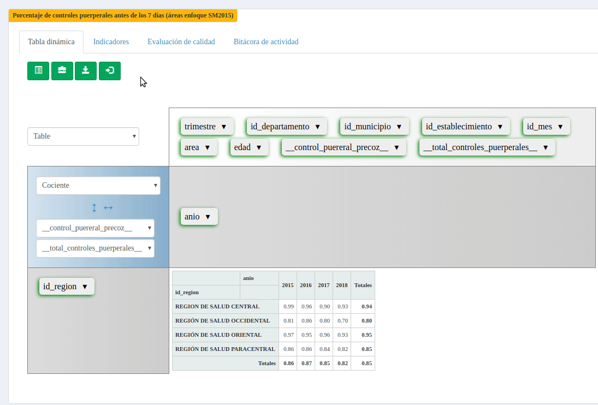

#### Heatmap
El mapa de calor utiliza por defecto el color rojo para los valores más altos y degradando hasta llegar a blanco para los valores más bajos.
Si el indicador tiene rangos de alertas definidos, se utilizarán esos en lugar de los colores por defecto. 

Las variaciones **Row Heatmap** y **Col Heatmap** utiliza la misma lógica pero sobre cada columna o fila para identificar los valores mayores y menores.
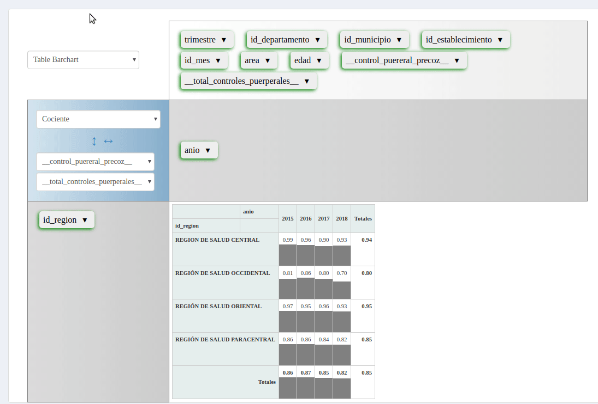

#### Table With Subtotal/ Table With Subtotal Bar Chart
Para utilizar estas visualizaciones, es necesario que se disponga de dos o más variables en la zona de columnas o en la zona de filas. 
De esta forma hará cálculos de subtotales para la variable que agrupe a otra. Por ejemplo si mostramos la tabla para Año y trimistre; 
se mostrará el resultado por cada trimestre, pero además mostrará el total al corte de cada año. El campo de nivel mayor (año en este ejemplo)
mostrará controles para contraer [-] o expandir [+] la información de los trimestres. 
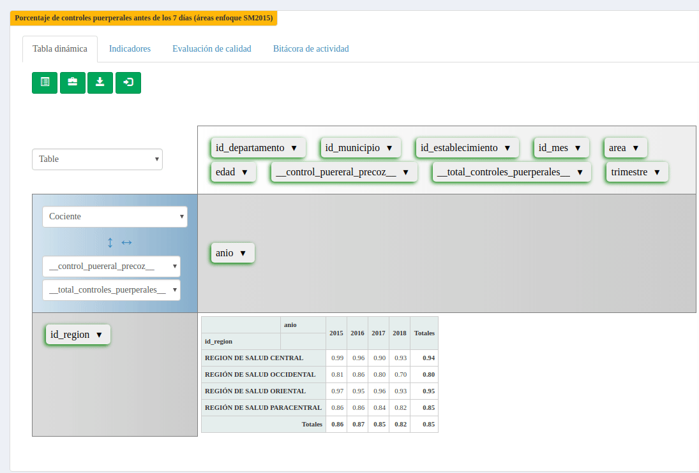

#### Visualizaciones de gráficos
Entre las visualizaciónes tenemos las que permiten representar los datos de manera gráfica: Barras horizontales, Barras horizontales apiladas, Barras, Barras apiladas, líneas, área, pastel, entre otras.
 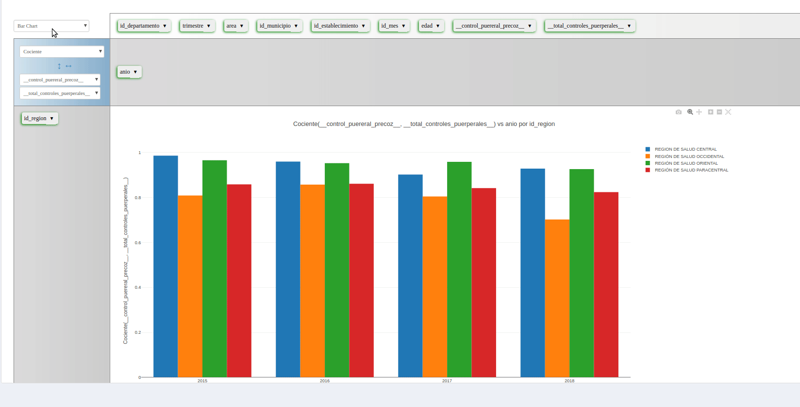

Al elegir un tipo de visualización de gráfico, se contará con opciones para descargar la imagen del gráfico, hacer zoom marcando una región, mover el gráfico, 
acercar o alejar la visualización y restablecer la escala.

 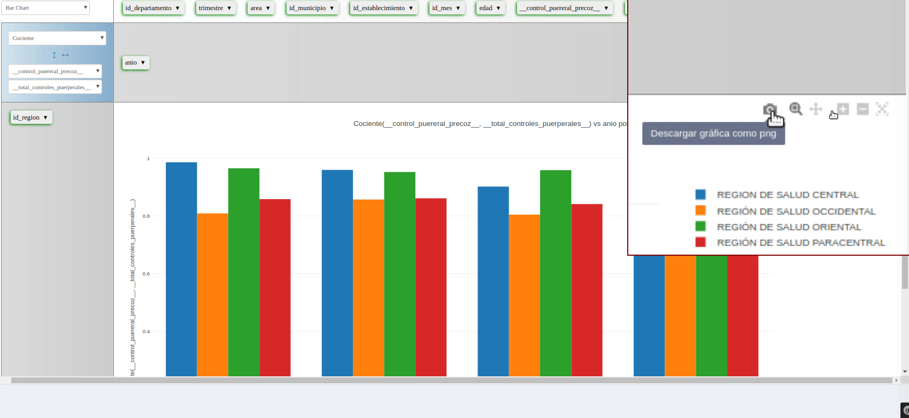

### Filtrar
Para mostrar solamente algunos de los elementos de las variables se da clic sobre el triángulo apuntando hacia abajo que está a la par de su nombre y se selecciona los elementos deseados
 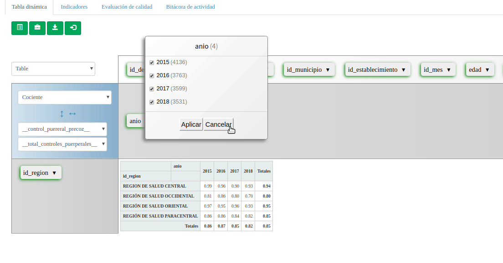

### Estados o escenarios
Se puede guardar la configuración o estado de una tabla dinámica. El estado guarda la posicion de las variables, los filtros aplicados, 
la función de agregación y sus parámetros, el tipo de visualización. Para luego poder recuperarlos posteriormente evitando tener que volver a 
realizar todos los pasos para obtener la configuración de la tabla dinámica. Al crear un escenario se puede definir como **escenario por defecto**, 
significa que al cargar el indicador nuevamente
esa será la configuración en que se mostrará. Se pueden borrar solamente los escenarios que el propio usuario ha creado, 
los escenarios creados por otros usuarios solo podemos verlos, no borrarlos.
 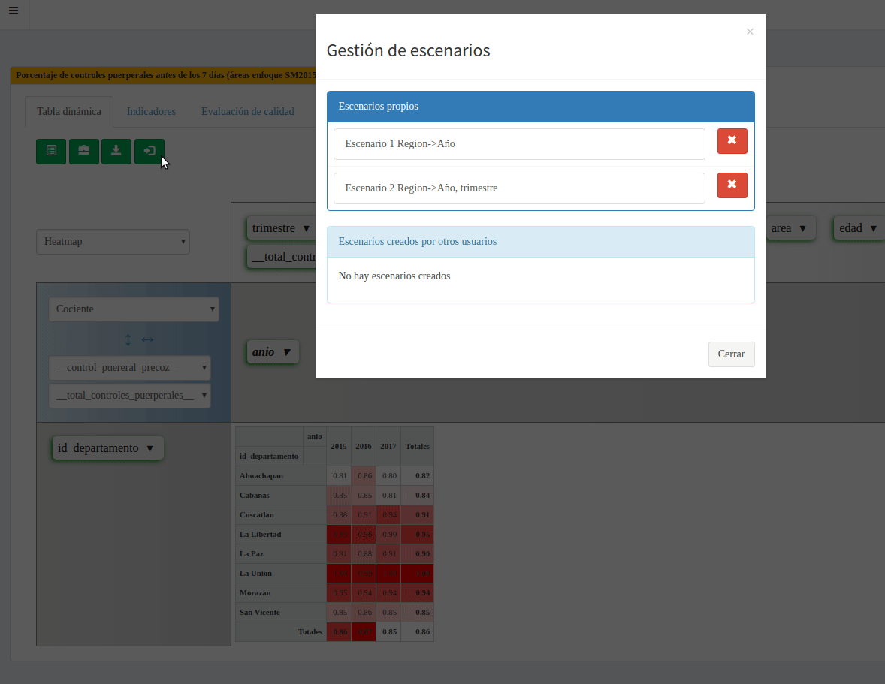

### Ordenar los resultados
Abajo de la función de agregación se encuentran dos controles de flechas, se utilizan para ordenar los resultados por la columna y fila de totales respectivamente. Si la flecha tiene dos puntas significa que no se ha aplicado un criterio de ordenamiento. La fecha arriba o a la derecha indican que se ha aplicado orden ascendente y a la izquierda o abajo orden descendente.
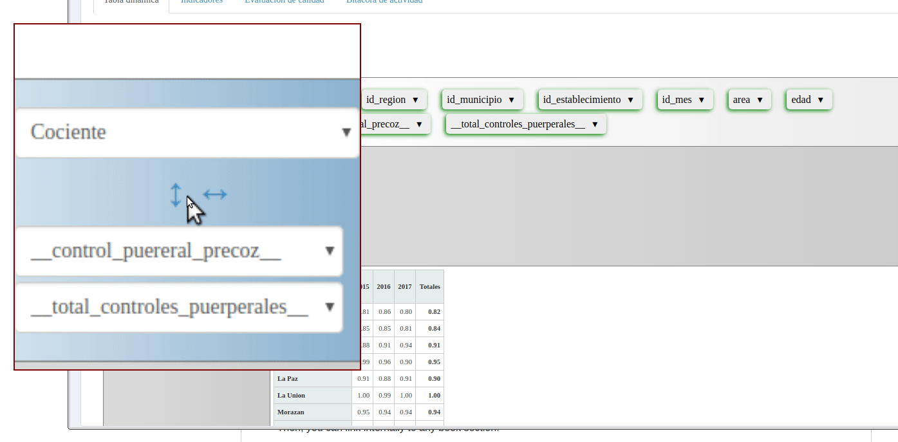
